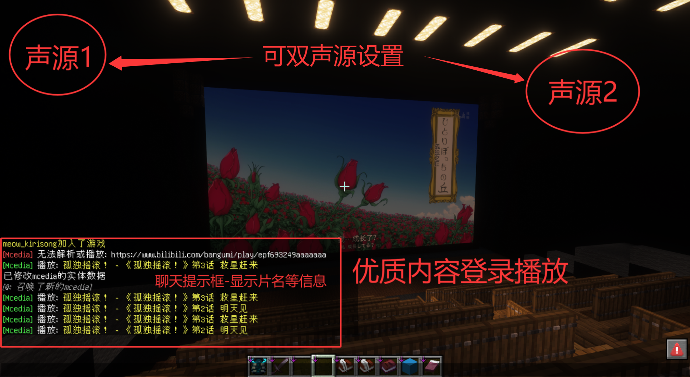
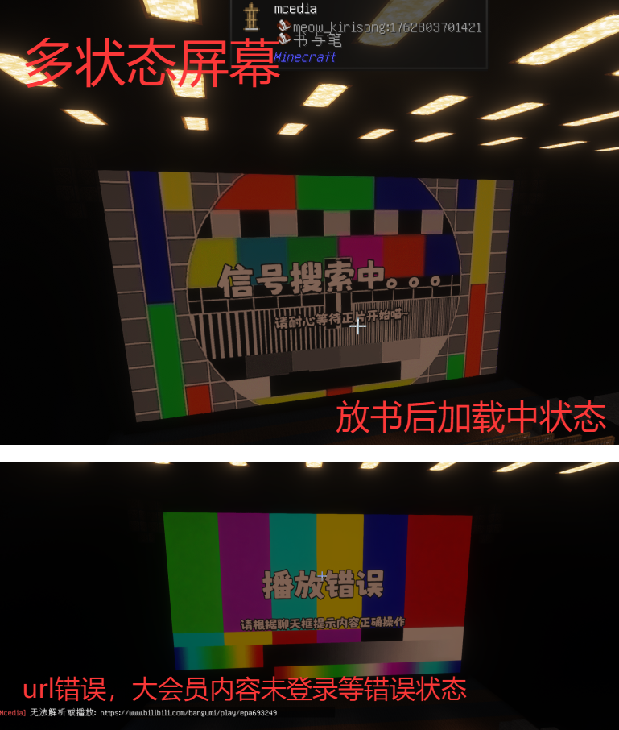
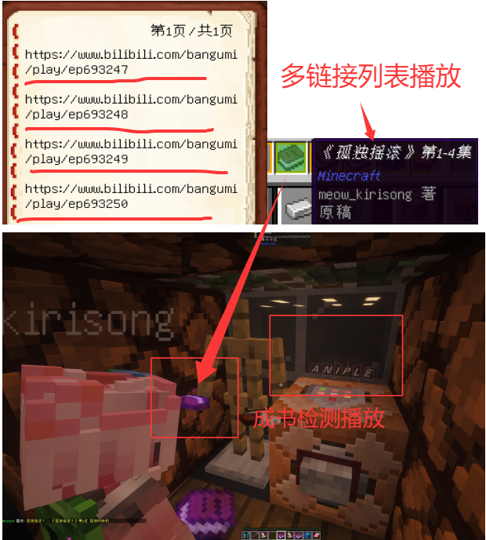
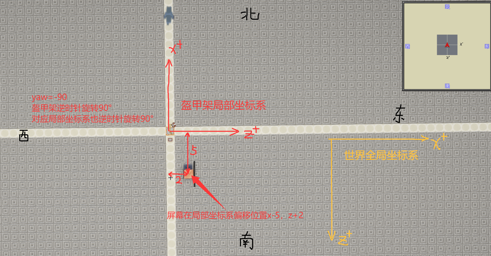
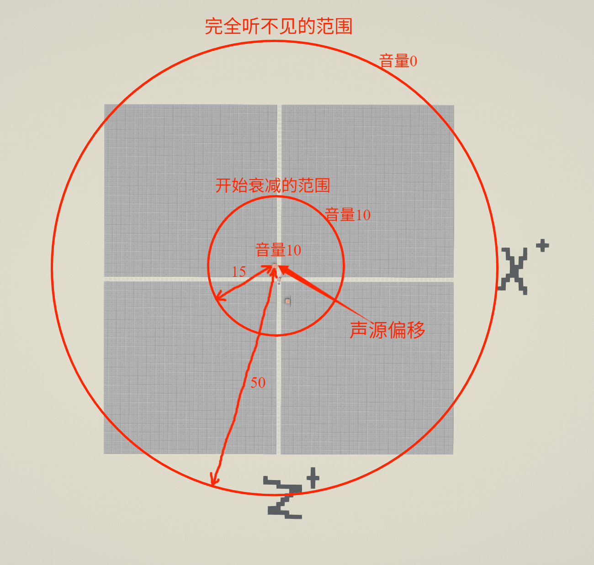

# Mcedia使用说明

## 项目简介

**此项目为 https://github.com/tobyprime/Mcedia 的分支，感谢tobyprime提供的原始项目❀**

感谢 **零食零食** 与 **喵kiri_颂** 共同参与该项目二次开发与测试

Mcedia 是一个 Minecraft Fabric模组，允许玩家在游戏中播放来自多个平台的视频和直播内容。

本版本目前仅支持 Minecraft 1.21.6-1.21.8。

---

## 目录

### 一. [功能介绍](#一功能介绍)

### 二. [快速开始](#二快速开始)

### 三. [详细功能使用介绍](#三详细功能使用介绍)

### 四. [模组配置文件说明](#四模组配置文件说明)

### 五. [服务器同步](#五服务器同步)

### 六. [常见问题汇总](#六常见问题汇总文档好长之我不想看但出问题怎么办qaq)

### 七. [功能限制与更新日志](#七功能限制与更新日志)

### Ⅰ、[附录](#附录)
---

## 一、功能介绍

### 支持播放的视频平台

1. **Bilibili 视频**
   - 普通视频（BV号）
   - 番剧、电影等大会员内容（ep号）（需要登录）
   - 支持多P视频播放与清晰度选择

2. **Bilibili 直播**
   - 支持直播房间号实时直播流播放

3. **抖音视频**
   - 支持抖音分享链接

4. **樱花动漫（Yhdm）**
   - 支持 yhdm.one 平台的视频播放


|原始功能| 二改新增功能                          |
|  ----  |---------------------------------|
|视频播放控制（跳转）| 视频播放控制（暂停/播放）                   |
视频画面位置和缩放调整| 自定义双声源配置                        |
视频音源位置配置调整| 成书检测功能                          |
单视频循环播放| 多链接播放列表支持                       |
服务器多玩家同步播放| 多链接列表循环播放                       |
|| 多状态静帧提示画面                       |
|| 视频缓存（可选）                        |
|| 硬件解码加速（可选）                      |
|| 自定义清晰度                          |
|| bilibili 账号登录（支持大会员内容，个人已付费内容等） |
|| 新增bilibili高质量频道，樱花动漫等播放源        |
|| 指令调试                            |


## 部分功能使用展示






## 二、快速开始

### 1、安装模组

1. 确保自己的游戏版本为`fabric 1.21.6`或`fabric 1.21.7`或`fabric 1.21.8`
2. 将 `[二改-麦西迪亚]mcedia-0.8-fabric-1.21.6-1.21.8.jar` 文件放入 `.minecraft/mods/` 目录
3. 启动游戏，模组自动初始化

### 2、播放视频

1. **合成盔甲架**并在**铁砧**中将其命名为 `mcdia`；只要名字中带有 `mcedia`，`mcdia` 即可。
2. **合成书与笔**
3. **在书的第一页写入视频链接**
   - 支持的链接格式：
     - Bilibili 视频：`https://www.bilibili.com/video/`+`bv号`
     - Bilibili 番剧/电影：`https://www.bilibili.com/bangumi/play/`+`ep号`
     - Bilibili 直播：`https://live.bilibili.com/`+`房间号`
     - 抖音视频：直接粘贴抖音分享文本（包含 `https://v.douyin.com/` 的链接）
     - 樱花动漫：`https://yhdm.one/vod-play/`+`后缀链接`

   - ！URL 开头和中间**不能有空格或换行**
4. 使用服务器内置的盔甲架编辑器（ASSN服为燧石） **将书与笔放入盔甲架主手**/或直接放入显示手臂的盔甲架

5. **等待视频加载播放**
---

## 三、详细功能使用介绍

### 1、基本播放控制（通过盔甲架姿态控制）
- **暂停/播放**：通过**隐藏/显示**盔甲架底座进行视频**暂停/播放**
- **音量控制**：通过调整盔甲架 **副手 X 轴旋转** 来控制播放音量
- **倍速播放**：通过调整盔甲架 **副手 Y 轴旋转** 来控制播放倍速
- **画面旋转**：通过调整盔甲架 **头部旋转** 或 **主体旋转** 来控制画面旋转
- **画面大小**：通过调整盔甲架的 **缩放（Scale）** 属性来控制画面大小

### 2、高级播放配置（通过副手的 **书与笔** 或 **署名的书** 控制）

在盔甲架**副手**放置 **书与笔** 或 **署名的书** ，可以配置更详细的参数：


#### **第一页：画面平移与缩放配置**

配置格式（每行一个数值）：
```
[局部坐标x轴偏移值]   #第1行，默认值0
[局部坐标y轴偏移值]   #第2行，默认值0
[局部坐标z轴偏移值]   #第3行，默认值0
[屏幕缩放倍数]        #第4行，默认值1
```
**参数说明**：
- **偏移值**：坐标系可分**全局坐标系**与**局部坐标系**，其中**全局坐标系**为整个世界的方向坐标，固定为南方为 **z+** 轴，东方为 **x+** 轴。而 **偏移值** 是基于盔甲架主体的**局部坐标系**进行偏移，<br>**盔甲架正前方**朝向为局部坐标系的**z+轴**，**盔甲架左手方向**为局部坐标系的**x+轴**。
- **屏幕缩放倍数**：屏幕大小的缩放系数，最终屏幕大小为该**屏幕缩放倍数**与**盔甲架缩放倍数**相乘

例如：
  ```
  -5
  0
  2
  0.8
  ```
表示屏幕向盔甲架右手方向偏移5格，向盔甲架正前方偏移2格，缩放为盔甲架缩放的0.8倍


#### **第二页：声源偏移与音量配置**

配置格式（每行一个数值）：
```
[声源x轴偏移值]      #第1行，默认值0
[声源y轴偏移值]      #第2行，默认值0
[声源z轴偏移值]      #第3行，默认值0
[音量最大值]         #第4行，默认值5
[最大值音量范围]     #第5行，默认值2
[最大可听范围]       #第6行，默认值500 
```
**参数说明**：
- **音量最大值**：音频的最大音量值
- **最大值音量范围**：最大音量到开始衰减的距离边界
- **最大可听范围**：可听见与完全听不到的距离边界

例如：
  ```
  3
  0
  -1
  10
  15
  50
  ```
表示视频声源（单声源）向盔甲架左手方向偏移3格，向盔甲架正后方偏移1格，最大音量为10，在声源位置半径15格才开始音量衰减，直到半径50格的位置彻底听不见。


#### **第三页：循环播放**

只需在当前页面中写入包含 `looping` 字符串即可启用循环播放，
默认值为空。

**注意事项**：循环播放会导致服务器视频播放不同步，因为每个客户端的循环时间可能略有差异。如果启用循环播放且缓存功能开启，视频会自动缓存到本地。

#### **第四页：清晰度选择**

在当前页输入一个清晰度名称，例如：
- `360P 流畅`
- `480P 清晰`
- `720P 高清`
- `1080P 高码率`
- `4K 超清`
- `自动`（默认值，会自动选择最高可用清晰度）

**清晰度名称必须与 Bilibili 网页显示的完全一致。**

### 3、双声源配置（副手书-声源配置拓展部分）

在某些场景下，您可能需要配置两个独立的声源，以满足声场搭建的需求。


**应用场景**：
- 立体声效果
- 多语言音轨
- 特殊音效需求

**双声源配置方法**：

当只有第1行至第6行有参数时，默认一个单声源。若第8行开始有参数，则生成第二个声源以供自定义配置。

在副手书与笔或成书的第二页，使用两个空行分隔两个声源的配置。**第1行至第6行**对声源1进行配置，**第8行至第13行**对声源2进行配置：

对应参数格式：
```
[声源1-声源x轴偏移值]      #第1行，默认值0
[声源1-声源y轴偏移值]      #第2行，默认值0
[声源1-声源z轴偏移值]      #第3行，默认值0
[声源1-音量最大值]         #第4行，默认值5
[声源1-最大值音量范围]     #第5行，默认值2
[声源1-最大可听范围]       #第6行，默认值500 
                          #第7行
[声源2-声源x轴偏移值]      #第8行，默认值0
[声源2-声源y轴偏移值]      #第9行，默认值0
[声源2-声源z轴偏移值]      #第10行，默认值0
[声源2-音量最大值]         #第11行，默认值5
[声源2-最大值音量范围]     #第12行，默认值2
[声源2-最大可听范围]       #第13行，默认值500 
```


### 4、跳转播放（通过主手的 书与笔 或 署名的书 控制）

#### Ⅰ、自行输入跳转时间跳转播放
在视频 URL 的**下一行**输入时间戳，格式：`小时:分钟:秒`

**示例**：
```
https://www.bilibili.com/video/BV233333
0:11:12
```
将会在视频的第11分12秒处开始播放。

**注意**：
- 时间戳必须在 URL 的下一行
- 如果下一行是另一个 URL，则不会应用时间戳

#### Ⅱ、通过URL时间戳参数跳转播放

对于Bilibili视频链接支持 `?t=` 参数来指定开始时间：

**格式参考**：

`?t=90`（90秒）

`?t=1m30s`（1分30秒）

`?t=1h30m45s`（1小时30分45秒）

**示例**：
```
https://www.bilibili.com/video/BV1234567890?t=150
```
将会在视频的第2分30秒处开始播放。

注意，在最新版mod中，链接下一行可设置时间戳、清晰度和分p（如有），且可以任意顺序，也可以写在同一行。

### 5、列表播放功能和列表循环（通过主手的 书与笔 或 署名的书 控制）

在 **主手** 的 **书与笔** 或 **成书** 中，可以在不同页面写入多个视频链接：

**示例**：
- 第一页：`https://www.bilibili.com/video/BV1234567890`
- 第二页：`https://www.bilibili.com/video/BV0987654321`
- 第三页：`https://live.bilibili.com/12345`

播放器会按顺序播放列表中的所有视频。

#### 单视频循环

如果 **主手** 的书中只有一个视频链接，在 **副手** 书的第三页写入 `looping`字符串

则当前单个视频播放结束后会自动重新播放。

#### 播放列表循环
如果 **主手** 的书中分多页写了多个视频链接，在 **副手** 书的第三页写入 `looping`字符串

则按列表顺序播放完最后一个视频后，会重新从第一个视频开始播放，即整个列表会循环播放


### 6、Bilibili 账号登录（仅对于bilibili平台视频源）

#### 为什么需要登录？

- 播放含带大会员要求的高质量内容（番剧、电影等）
- 访问需要登录才能解锁权限观看的视频（包括但不限于个人充电档视频，个人付费内容）
- 获取解锁更高质量的清晰度选项

#### **登录流程**：
   - 执行**登录指令**后，mod会生成一个登录链接
   - 点击聊天中的链接复制到剪切板
   - 将链接发送给手机并用手机打开链接
   - 在手机中选择用bilibili打开并授权登录
   - 登录成功后，Cookie会自动保存，并在游戏内同步登录成功，下次无需登录（除非很久没登录）

### 指令介绍

这是开始使用 Mcedia 的基础。

- **/mcedia help [分类]**
    - **功能**: 显示帮助信息。是你最好的朋友！
    - **用法**: 直接输入 /mcedia help 可以看到所有可用分类。输入 /mcedia help control 等可以查看特定分类的详细指令。
- **/mcedia init**
    - **功能**: **核心指令**。将你准星对准的一个普通盔甲架初始化为 Mcedia 播放器。
    - **用法**: 将你的准星对准一个盔甲架，然后执行此命令。成功后，这个盔甲架就可以被其他指令控制了。
- **/mcedia status**
    - **功能**: 查看你准星对准的 Mcedia 播放器的详细状态。
    - **用法**: 看着一个 Mcedia 播放器执行，会显示当前播放的URL、进度、清晰度、播放状态等信息。

------

##### 播放器控制 (/mcedia control ...)

所有这些指令都作用于你**准星对准**的 Mcedia 播放器。

###### 基础播放控制

- **/mcedia control pause**: 暂停播放。
- **/mcedia control resume**: 恢复播放。
- **/mcedia control stop**: 停止播放并清空当前媒体。
- **/mcedia control skip**: 跳过当前项，播放播放列表中的下一个。
- **/mcedia control seek <时间>**: 跳转到指定时间。
    - **时间格式**: 非常灵活！支持 [时:]分:秒 (如 1:23:45 或 01:30) 或纯秒数 (如 90)。支持自动进位。

###### 参数设置 (/mcedia control set ...)

- **/mcedia control set url <链接>**
    - **功能**: **快速开始！**让播放器立即播放指定的 URL。这会覆盖当前的播放列表。
- **/mcedia control set volume <0-100>**
    - **功能**: 设置播放器的音量百分比。
- **/mcedia control set loop <true|false>**
    - **功能**: 设置当前媒体是否循环播放。
- **/mcedia control set screen offset <x> <y> <z> <缩放>**
    - **功能**: 调整视频屏幕相对于盔甲架的位置和大小。
- **/mcedia control set audio primary <x> <y> <z> <音量> <最小距离> <最大距离>**
    - **功能**: 设置主声源的位置、最大音量和衰减范围。
- **/mcedia control set audio secondary ...**
    - **功能**: 同上，用于设置副声源。
- **/mcedia control set audio secondary_enabled toggle**
    - **功能**: 启用或禁用副声源。

###### 全局播放控制

- **/mcedia control all <操作>**
    - **功能**:**同时控制**当前世界中**所有**的 Mcedia 播放器。
    - **可用操作**: pause, resume, stop。

------

#### 播放列表管理 (/mcedia playlist ...)

通过指令动态管理播放列表，同样作用于你**准星对准**的播放器。

- **/mcedia playlist list [页码]**
    - **功能**: 以可交互的方式列出当前播放列表。
    - **交互**:
        - **悬浮**: 鼠标悬停在条目上可查看 URL、时间戳、P号、清晰度等详细信息。
        - **点击**: 点击条目会自动在你的聊天框填入移除该条目的指令。
- **/mcedia playlist add <URL>**: 在播放列表末尾添加一个视频。
- **/mcedia playlist insert <序号> <URL>**: 在指定位置插入一个视频。
- **/mcedia playlist remove <序号>**: 移除指定位置的视频。
- **/mcedia playlist clear**: 清空整个播放列表并停止播放。

##### 书本高级配置

你仍然可以通过**盔甲架主手中的书**来定义播放列表，并且拥有极高的灵活性：
在书本中，你可以在每个 URL 下方添加一行或多行参数来精细控制，参数包括：

-
- **时间戳**: [HH:]MM:SS 或纯秒数 (如 01:30)
- **B站分P**: p<数字> (如 p3)
- **清晰度**: 1080P, 720P 等
  这些参数可以**任意顺序**、**分多行**写，甚至可以**写在同一行**用空格隔开！
  **示例:**

```
https://.../video/BV123...
p3 720P 01:30
```

------

#### 配置预设 (/mcedia preset ...)

保存和加载复杂的屏幕/音频位置设置，告别重复输入。

- **/mcedia preset list [页码]**
    - **功能**: 列出所有已保存的预设。
    - **交互**:
        - **悬浮**: 查看该预设包含的所有位置和音频参数。
        - **点击**: 在文件浏览器中打开 presets.json 文件，方便手动编辑。
- **/mcedia preset save <名称>**: 将当前看着的播放器的屏幕和音频设置保存为一个新预设。
- **/mcedia preset load <名称>**: 将一个预设应用到当前看着的播放器上。
- **/mcedia preset delete <名称>**: 删除一个预设。
- **/mcedia preset reload**: **(热更新)** 从文件中重新加载所有预设，方便在游戏外编辑后同步。

------


#### 全局及账户指令

这些指令影响整个 Mod 的行为。

##### Bilibili 账户

- **/mcedia bilibili <操作>** (或简写 **/mcedia b <操作>**)
    - **功能**: 管理你的 Bilibili 账户登录，用于访问需要会员或登录才能观看的内容。
    - **可用操作**:
        - login: 扫描二维码登录。如果已登录，会提示当前用户。
        - login force: 强制开始新的登录流程，用于切换账号。
        - logout: 登出当前账号。

##### 缓存管理

- **/mcedia cache <操作>**
    - **功能**: 管理视频缓存，缓存可以让你在网络不佳时流畅播放或离线播放。
    - **可用操作**:
        - list: 列出所有已缓存的视频文件。
        - clear: 清空所有缓存。
        - prefetch <URL>: 在后台预先下载和缓存一个视频。

##### Mod 配置

- **/mcedia config <操作>**
    - **功能**: 在游戏中实时修改 Mod 的配置文件。
    - **可用操作**:
        - get <参数名>: 查看一个配置项的当前值。
        - set <参数名> <值>: 修改一个配置项的值并自动保存。**(输入set后按Tab键可查看所有可用参数)**
        - save: 手动保存当前所有配置。load: 从文件重新加载配置。

mod会在每次进入游戏时自动进行登录状态检查，确保Cookie的有效性。如果Cookie过期，会提示您重新登录，登录成功后，会显示当前登录的用户名。

**注意！警告**：登录成功后会将cookie存入本地配置文件`mcedia.cookie.properties`中，而您的Bilibili登录Cooki属于隐私信息。如下操作以确保隐私安全：

- 不要分享此文件给他人，除非您确保他人可以食用您的隐私
- 若要直接打包发送客户端给他人，在发送客户端文件时请检查并删除此文件
- 此文件由mod自动管理写入删除，补药手动编辑QAQ

---

## 四、模组配置文件说明

### 配置文件位置

模组初始化后，会在 `.minecraft/config/` 目录下生成以下配置文件：

- **`mcedia.properties`** - 主配置文件
- **`mcedia.cookie.properties`** - Cookie 配置文件（自动生成，不要手动编辑）

### 主配置文件（mcedia.properties）

```properties
# 缓存功能开关
caching.enabled=false

# FFmpeg 网络缓冲区大小（字节，默认 262144 = 256KB）
# 高分辨率视频（如 4K）可以适当增大此值以提高流畅度
performance.ffmpeg.bufferSize=262144

# FFmpeg 探测大小（字节，默认 10485760 = 10MB）
# 用于初始探测视频流信息
performance.ffmpeg.probeSize=10485760

# FFmpeg 网络超时（微秒，默认 10000000 = 10秒）
performance.ffmpeg.timeout=10000000

# 硬件解码开关（建议开启以提升性能）
performance.hardwareDecoding=true
```
#### Ⅰ、视频缓存功能（默认关闭）

设置主配置文件参数来**启用缓存**：
```properties
caching.enabled=true
```

**缓存机制**：缓存文件存储在 `.minecraft/mcedia_cache/` 目录，当播放设置中启用循环播放时，视频会自动缓存，并使用SHA-1哈希命名，确保文件唯一性。**在退出世界时，缓存文件会自动删除清理**。

**缓存优劣**：减少循环播放时重新加载的网络流量，同时提高循环播放时播放流畅度。其中非会员内容支持离线播放（已缓存的视频），但会占用磁盘空间，**！！如果操作不当可能会一直下载造成巨大磁盘占用**。

#### Ⅱ、硬件解码功能（默认开启）


设置主配置文件参数来**启用硬件解码**：
```properties
performance.hardwareDecoding=true
```

**硬件解码优势**：降低 CPU 占用，提高播放流畅度，并且支持更高分辨率的视频。

**系统要求**：需要支持硬件解码的显卡，如NVIDIA、AMD、Intel等集成显卡。


#### Ⅲ、性能调优建议：
播放 4K 视频时如果遇到卡顿，可以适当增大 `performance.ffmpeg.bufferSize` 和 `performance.ffmpeg.probeSize`，增大这些值会提高流畅度，但会增加内存占用和初始加载时间。

### Cookie 配置文件（mcedia.cookie.properties）

**注意！警告**：此文件包含您的 Bilibili 登录 Cookie，属于隐私信息！

- 不要分享此文件给他人，除非您确保他人可以食用您的隐私
- 若要直接打包发送客户端给他人，在发送客户端文件时请检查并删除此文件
- 此文件由mod自动管理写入删除，不要手动编辑


---


## 五、服务器同步

### Mcedia 支持多玩家同步播放功能，所有玩家可以同时观看相同的视频。

### 同步原理

- 服务器同步功能基于其盔甲架 **主手** 书的 **物品名称**
- 服务器插件会监听玩家对盔甲架的操作，当玩家将书与笔放入盔甲架主手时，插件会自动在物品名称中添加`用户名:时间戳`
- 各玩家客户端根据服务器发回的时间戳计算播放进度，如此所有客户端都能根据相同的时间戳同步播放

### 服务器端配置

需要在服务器安装对应的 Paper 插件：

**Paper 1.21.7**：`paper-1.21.7/` 目录下的插件  
**Paper 1.21.8**：`paper-1.21.8/` 目录下的插件


### 同步限制

以下操作会导致同步不同步：
- 调整播放倍速（副手 Y 轴旋转）
- 启用循环播放
- 手动跳转播放进度

---

## 六、常见问题汇总（文档好长之我不想看但出问题怎么办QAQ）

### Q1: 视频无法播放

**可能原因**：
1. URL 格式不正确
2. 视频需要登录（大会员内容）
3. 视频已被删除或下架
4. 网络连接问题


**解决方法**：
- 检查 URL 格式是否正确
- 尝试使用 `/mcedia login` 登录
- 尝试播放其他视频，是不是相同情况
- 检查网络连接

### Q2: 提示需要登录

**解决方法**：
```
/mcedia login
```
按照“**三、详细功能使用介绍**”中的“**6、Bilibili 账号登录**”的“**登录流程**”完成登录。

### Q3: 视频播放卡顿

**可能原因**：
1. 网络速度慢
2. 硬件解码未启用
3. 缓冲区设置过小

**解决方法**：

1. 启用硬件解码（`performance.hardwareDecoding=true`）
2. 增大缓冲区大小（`performance.ffmpeg.bufferSize`）
3. 选择较低的清晰度配置
4. 启用视频缓存（`caching.enabled=true`）（不建议）

可尝试按照“**四、模组配置文件说明**”中 **主配置文件** 来修改如上参数

### Q4: 声音无法听到

**检查项**：
1. 盔甲架副手 X 轴旋转是否为 0°（0° = 100% 音量）
2. 音频源配置是否正确
3. 游戏音量设置
4. 音频范围设置是否合理

### Q5: 画面位置不对

**解决方法**：
- 使用副手书与笔的第一页配置画面偏移
- 调整盔甲架的旋转和缩放
- 检查偏移值是否正确

按照“**三、详细功能使用介绍**”中的“**1、基础播放控制**”或“**2、高级播放配置**”完成调节。

### Q6: 服务器同步不同步

**可能原因**：
1. 未安装服务器插件
2. 服务器插件不兼容
3. 服务器权限阻止时间戳发布
4. 调整了播放速度
5. 启用了循环播放
6. 手动跳转了播放进度

**解决方法**：
- 确保服务器安装了对应版本的插件
- 确保服务器各插件之间的兼容性与故障排查
- 避免调整播放速度和启用循环
- 使用服务器同步时，不要手动跳转

### Q7: 缓存文件占用空间过大

**说明**：
- 缓存文件在退出世界时将自动清理删除
- 如需手动清理，请删除 `.minecraft/mcedia_cache/` 目录
- 在配置文件中禁用缓存：`caching.enabled=false`

禁用缓存在“**四、模组配置文件说明**”的 **主配置文件** 中设置

### Q8: 抖音视频无法播放

**检查项**：
1. 分享文本中是否包含 `https://v.douyin.com/` 链接
2. 链接格式是否正确
3. 视频是否仍然有效

**解决方法**：
- 确保直接粘贴抖音分享文本（包含完整链接）
- 尝试重新获取分享链接

### Q9: B站短链接无法识别

**说明**：
mod支持 `b23.tv` 短链接，短链接会自动展开为完整链接，如果无法展开，请使用完整链接

### Q10: 清晰度选择无效

**检查项**：
1. 清晰度名称是否与网页显示完全一致
2. 是否已登录（某些清晰度需要登录）
3. 视频是否提供该清晰度

**解决方法**：
- 使用 `自动` 让模组选择最高可用清晰度
- 确保已登录 Bilibili 账号

---

## 七、功能限制与更新日志


### 功能限制

1. 在服务器上，调整 **播放倍速** 或设置 **循环播放** 会导致服务器不同步

2. 缓存功能本身会增加内存占用，可在mod配置文件中设置是否启用，退出世界时缓存会被清理

3. 由于同时播放多个视频会占用大量资源，限制最多同时播放 **5** 个视频

4. 仅支持列出的视频平台，其中bilibili平台可能需要登录

### 更新日志
#### [2025/11/05]
- 修复了先前单人模式的渲染线程调用错误导致的崩溃
- 将播放时聊天框提示的链接信息改为显示标题和作者
- 增加了直播清晰度调整
- 增加了对成书的检测
#### [2025/11/06]
- 修复了循环播放模式失效与每次播放视频卡画面时音频重载的bug
- 修复了线程不安全导致的驱动崩溃的问题
- 修复了先前版本在加入服务器时崩溃的问题
#### [2025/11/07]
- 更改了gradle配置
- 新增b站登录并改进画面渲染
- 新增视频帧池子尝试优化4k播放时帧率下降问题
#### [2025/11/08]
- 将缓存功能放入mod配置文件中自行设置启用
- 修复了打掉盔甲架崩溃的问题
- 修复直播低画质报错与直播播放
- 修复了画面过快，音画不同步的问题
- 为mod配置文件添加了更多可配置选项
- 增加了登录检测防止未登录状态对应视频流画质播放错误的问题
- 解决了播放时卡顿以及同步误差过大的问题
- 恢复空闲时渲染屏幕
- 使用try块保证栈平衡
#### [2025/11/09]
- 优化了服务器同步下的seek方法
- 新增樱花动漫视频源并优化边界检查
- 添加了视频暂停功能
- 新增了多链接播放列表与bilibili短链识别
- 修复了反复放书崩溃的问题
#### [2025/11/10]
- 添加了双声源自定义配置功能
- 添加了多状态屏幕显示
- 修复了客户端非正常关闭后不断缓存的问题
- 修复了抖音视频播放与暂停后可能快进三秒的bug
- 修正了先前音源配置坐标系的计算错误
- 优化了整体逻辑
#### [2025/11/11]
- 修复了Seek跳转与加载状态静帧显示
- 修复了视频作者显示
- 修复了抖音视频的详细信息显示
- 新增加入世界时提示cookie有效性与持有者信息
---

## 附录

### Ⅰ、支持的 URL 格式

#### Bilibili 视频
- `https://www.bilibili.com/video/BVxxxxx`
- `https://www.bilibili.com/video/BVxxxxx?p=2`（多P视频）
- `https://www.bilibili.com/video/BVxxxxx?t=90`（带url时间戳）

#### Bilibili 番剧/电影
- `https://www.bilibili.com/bangumi/play/epxxxxx`
- `https://www.bilibili.com/bangumi/play/epxxxxx?t=90`

#### Bilibili 直播
- `https://live.bilibili.com/xxxxx`

#### Bilibili 短链接
- `https://b23.tv/xxxxx`（自动展开）

#### 抖音
- 抖音分享文本（包含 `https://v.douyin.com/` 链接）

#### 樱花动漫
- `https://yhdm.one/vod-play/xxxxx`

### Ⅱ、指令列表

| 指令| 说明 |
|------|------|
| `/mcedia login` | 登录 Bilibili 账号 |
| `/mcedia login force` | 强制重新登录 |
| `/mcedia logout` | 退出登录 |

### Ⅲ、配置文件示例

**mcedia.properties**：
```properties
# 缓存功能
caching.enabled=false

# 性能设置
performance.ffmpeg.bufferSize=262144
performance.ffmpeg.probeSize=10485760
performance.ffmpeg.timeout=10000000
performance.hardwareDecoding=true
```

---

**文档版本**：1.0  
**最后更新**：2025年11月11日  
**适用版本**：Mcedia for Minecraft fabric 1.21.6-1.21.8  
<br><br>
## <center>二改-麦西迪亚[Mcedia]项目贡献
### <center>tobyprime
#### <center>提供了供二次开发的原始项目Mcedia

### <center>零食零食

#### <center>是整个二改开发过程的主心骨

<center>提出并修复实现了很多改进与功能方法

<center>主要负责代码编写与debug调试

<center>在每次构建版本时不断迭代测试

### <center>喵Kiri_颂

#### <center>是整个二改开发过程的大聪明

<center>提出了部分功能创意并编写实现

<center>主要负责暴力测试反馈与debug调试

<center>负责编写使用说明文档
